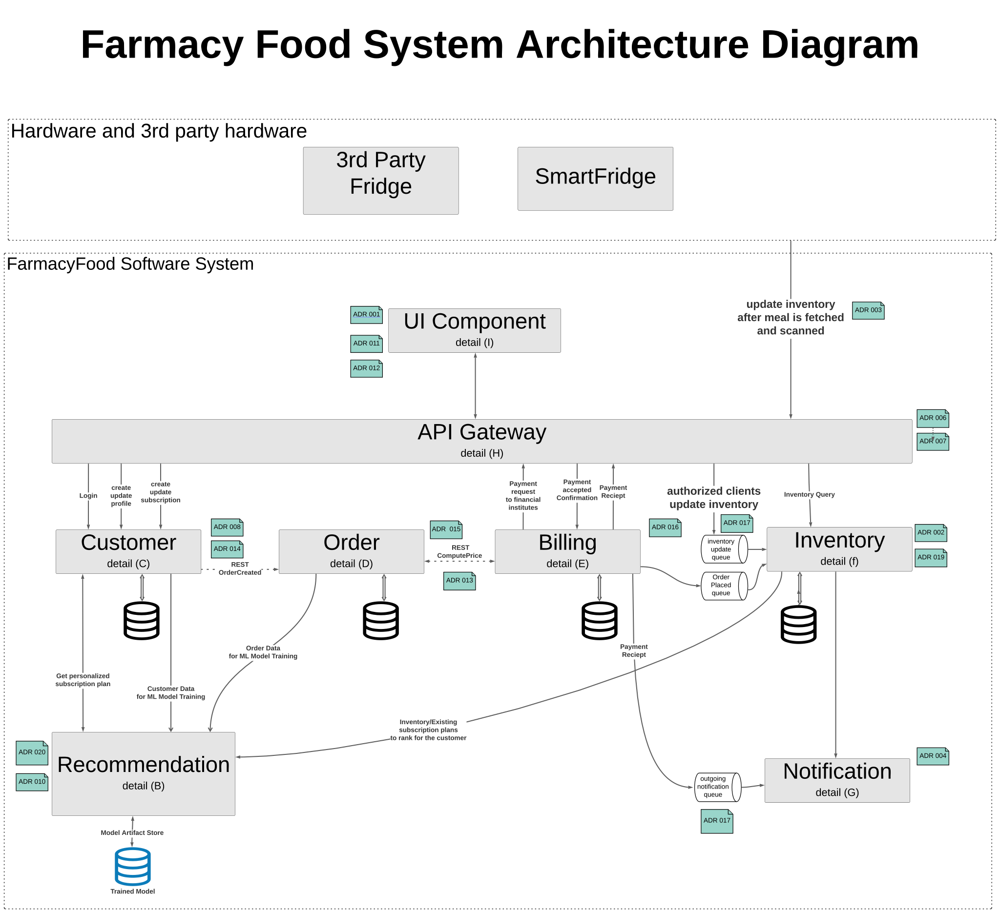

# Farmacy Food Kata

selfdriventeam's architecture proposal for Farmacy Food

# The Customer
## Farmacy Food
**Let Food Be Thy Medicine.**

[Farmacy Food](https://www.farmacyfood.com/) creates tasty meals around your dietary needs, incorporating ingredients known to have beneficial properties to support your health and well-being.

# Our Vision

SelfDrivenTeam sees a scalable, extensible system running on a cloud provider where the system scales itself up and down dynamically based on load and response times.

SelfDrivenTeam's system provides secure, reliable functionality for Farmacy Food's customers, nutritionists, chefs, and delivery personel so they can focus on their areas of expertise while showcasing Farmacy Food's special sauce, the combination of the fresh, wholesome food, nutritionists, and a proprietary meal reccomendation engine to provide customers with fresh tasty, nutriutious, and low cost meals tailored to each customer's individual needs and preferences.

The system initally runs for the Detroit, Michigan area, but as service area and usage grows the system can easily scale out to handle multiple geographic areas **and** scale up within an area to handle increasing customer/POS density. The system includes all of the components needed to meet all of the current requirements and provides extensibility to add known and opportunistic future enhancements.

# Requirements from the customer
## Users
Dozens of automated fridges and representative run kiosks, thousands of customers.

## Requirements
1) Must integrate with 3rd party smart fridges to obtain inventory and purchase activity
1) Smart Fridges Produce item inventory levels and purchases. The smart fridges have a cloud based management system that handles communication with the Smart Fridge so obtaining this data would be through an API.
1) Must integrate with point of sale system at kiosks
1) The Kiosk is a sublet space inside another business where we will sell our product but have an employee handle the transactions through a point of sale. The same data should be accessible through the POS systems API’s.
1) Mobile and Web accessible
1) Support providing feedback on items of verified purchases and in app surveys
1) Accept coupons and promotional pricing
1) Send inventory updates to central kitchen

## Long term Goals
1) Long term would like to allow multiple vendors to offer items through points of sale
1) Wants to harvest data to provide personalized recommendations based on users health goals, purchase history, and item ratings

# Our Solution

Broken down into 8 major components in a micro-service based architecture, the system provides a **S.O.L.I.D.** foundation for the next steps (detailed design and implementation). The following diagrams, Architectural Decision Records, Personas, and intermediate artifacts provide more detail on the benefits of the system and why various trade-offs were made when defining the achitecture.

## Detailed Architecture

| Index | Description |
|-------|-------------|
| A | [High Level Architecture](doc/arc/components/high_level.md) |
| B | [Recommendation Engine](doc/arc/components/recommendation_engine.md) |
| C | [Customer Domain](doc/arc/components/customer_domain.md) |
| D | [Order Domain](doc/arc/components/order_domain.md) |
| E | [Billing Domain](doc/arc/components/billing_domain.md) |
| F | [Inventory Domain](doc/arc/components/inventory_domain.md) |
| G | [Notification Engine](doc/arc/components/notification_engine.md) |
| H | [API Gateway](doc/arc/components/api_gateway.md) |
| I | [?? UI Component](doc/arc/components/ui_component.md) |

## Architectural Decision Records

| Index | Description |
|-------|-------------|
| [ADR_001](doc/arc/adrs/adr_001.md) | Use actor/action to identify components |
| [ADR_002](doc/arc/adrs/adr_002.md) | No delivery component is needed for now |
| [ADR_003](doc/arc/adrs/adr_003.md) | Require stock monitoring and calibration |
| [ADR_004](doc/arc/adrs/adr_004.md) | Using a notification system |
| [??ADR_006](doc/arc/adrs/adr_006.md) | Sharding/routing as per location |
| [ADR_007](doc/arc/adrs/adr_007.md) | Using External Identity Provider |
| [ADR_008](doc/arc/adrs/adr_008.md) | Data needs to be anonymized for PII |
| [??ADR_009](doc/arc/adrs/adr_009.md) | 3rd party health hooks into the customer info |
| [??ADR_010](doc/arc/adrs/adr_010.md) | Recommendation engine is a batch system |
| [ADR_011](doc/arc/adrs/adr_011.md) | Using micro-services vs event driven |
| [ADR_012](doc/arc/adrs/adr_012.md) | Use mobile friendly web app |
| [ADR_013](doc/arc/adrs/adr_013.md) | Use REST between Customer, Order and Pricing |
| [ADR_014](doc/arc/adrs/adr_014.md) | Customer subdomain design decisions|
| [ADR_015](doc/arc/adrs/adr_015.md) | Order subdomain design decisions|
| [ADR_016](doc/arc/adrs/adr_016.md) | Billing & Pricing subdomain design decisions|
| [ADR_017](doc/arc/adrs/adr_017.md) | Use queue to update the inventory and external notification|
| [ADR_018](doc/arc/adrs/adr_018.md) | Notification subdomain design decisions|
| [ADR_019](doc/arc/adrs/adr_019.md) | Inventory subdomain design decisions|
| [ADR_020](doc/arc/adrs/adr_020.md) | Recommendation subdomain design decisions|

## Personas

| Name | Role |
|------|------|
| [Alice](doc/personas/alice_(chef).md) | Chef |
| [Barbara](doc/personas/barbara_(kiosk_worker).md) | Kiosk Worker |
| [Claire](doc/personas/claire_(analyst).md) | Analyst |
| [Edward](doc/personas/edward_(delivery_driver).md) | Delivery Driver |
| [Jennifer](doc/personas/jennifer_(subscriber).md) | Subscription Customer |
| [Mark](doc/personas/mark_(nutritionist).md) | Nutritionist |
| [Scott](doc/personas/scott_(eater).md) | Occasional Customer |

## Intermediate Artifacts

* [Actors/Actions for identifying subdomains](doc/artifacts/actor_actions.md)
* [Component architecture characteristic](doc/artifacts/arch_characteristic.md)
* [C4: FarmacyFood System context map](doc/arc/images/context_map.svg)
