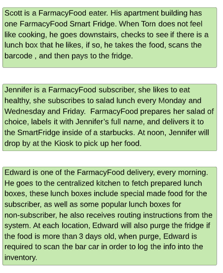

# [ADR_003](../../README.md) Require stock monitoring and calibration subcomponent inside of Inventory subdomain

Date: 10/27

## Status

accepted

## Context

A use case of customer make an order online and pick up the food at the SmartFridge. We discovered that there should be a mechanism to update the inventory after the food is fetched by the customer.

## Decision

Monitoring and calibration can be resolved by keeping record of what is taken out of the fridge. We delegate this functionality to the SmartFridge. Similar to common self checkout process.

## Consequences

The workflow requires a bar-code has to be scanned after it is taken out the SmartFridge for purchase, or purge, and subsequently bar-code scanned event will be published to update the inventory.

