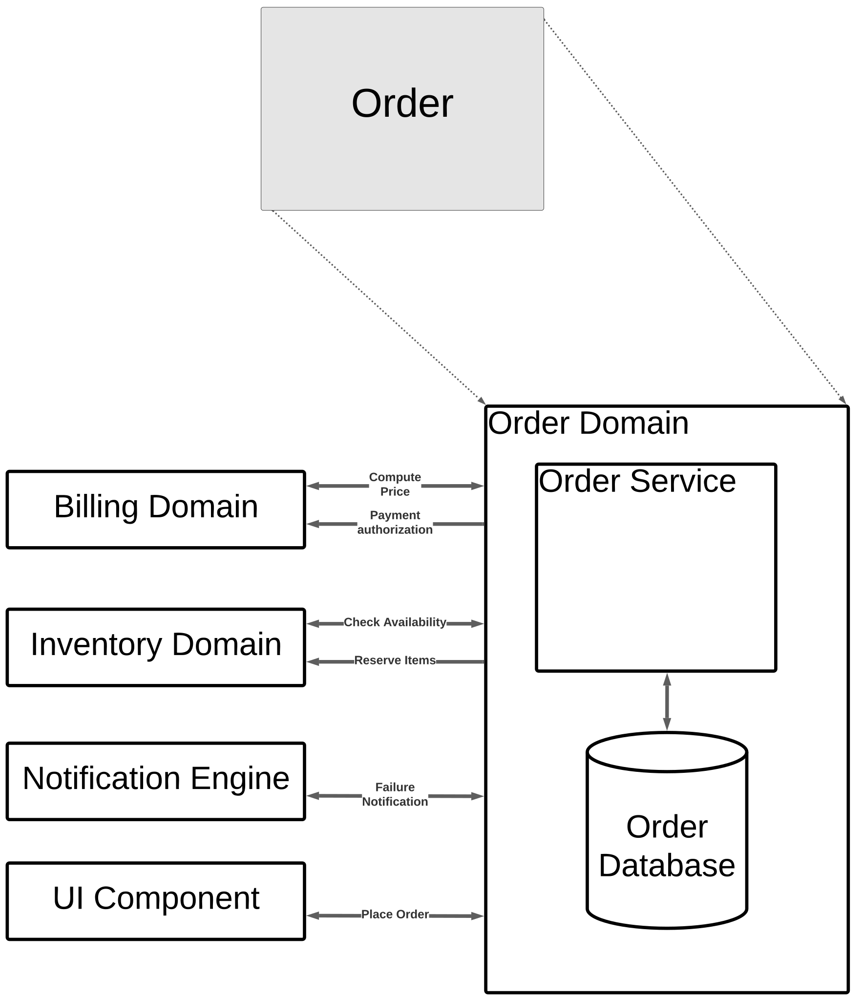

# [ADR_015](../../../README.md) Order subdomain design decisions

Date: 10/31

## Status

accepted

## Context

This adr captures component design decisions in Order subdomain.

## Decision

We follow the same design process as we used before, which is, identifying top level pieces first. 　

Among actor/action, event storming, and workflow approaches. We chose workflow approach, because in this subdomain: data related to the order flow through the system, going through different stages of transformation: such as validation, pricing, evaluation.

## Consequences
This subdomain will most likely implemented in a pure functional way.

