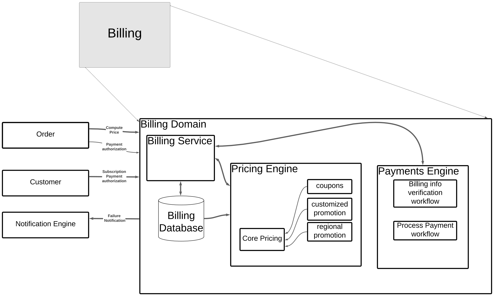

# [Billing Domain](../../../README.md)

The Billing Domain consists of 2 major subsystems and 1 major databases. It manages and controls access to all payment processing and pricing information to authorized users. Because payment requests can take a variable amount of time and we need to avoid double billing, any request for transaction is placed in a durable, processed exactly once queue.

The **Billing Service** provides the interface and authorization based on presented ID. This includes, but is not limited to setting standard pricing, defining coupons, and requesting payments from 3rd party systems. All requests to the billing domain **must** go through the **Billing Service**.

The **Pricing Engine** is responsible for calculating the standard and effective prices after applying any applicable discounts and coupons.

The **Payments Engine** is responsible for all external communications with 3rd party payment vendors. The payments engine isolates all interactions to provide an additional layer of security.

The **Billing Database** maintains the source of truth for all pricing and coupon/discount/promotions. No customer data is stored in the billing database

## Communicates With:
* [Customer Domain](/doc/arc/components/customer_domain.md) for processing subscription payments
* [Notification Engine](/doc/arc/components/notification_engine.md) for sending out information on failures
* [Order Domain](/doc/arc/components/order_domain.md) to provide up-front pricing and upon order placement

