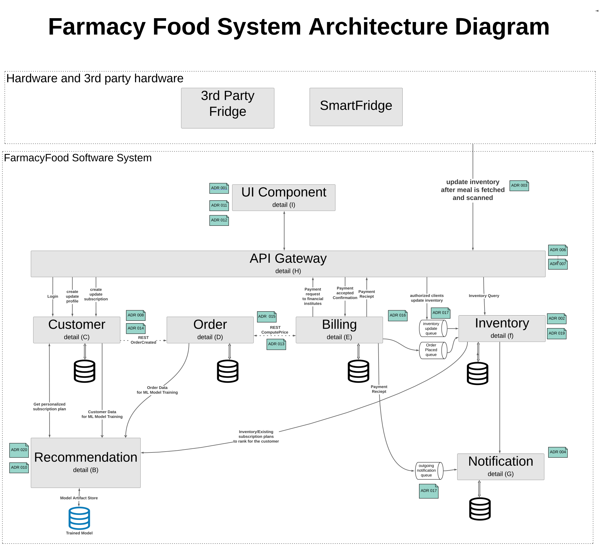

# [High Level Architecture](../../../README.md)

Broken down into 8 major components in a micro-service based architecture, the system provides a **S.O.L.I.D.** foundation for the next steps (detailed design and implementation). The following diagrams, Architectural Decision Records, Personas, and intermediate artifacts provide more detail on the benefits of the system and why various trade-offs were made when defining the achitecture.

## Detailed Architectural Diagrams

| Index | Description |
|-------|-------------|
| B | [Recomendation Engine](/doc/arc/components/recommendation_engine.md) |
| C | [Customer Domain](/doc/arc/components/customer_domain.md) |
| D | [Order Domain](/doc/arc/components/order_domain.md) |
| E | [Billing Domain](/doc/arc/components/billing_domain.md) |
| F | [Inventory Domain](/doc/arc/components/inventory_domain.md) |
| G | [Notification Engine](/doc/arc/components/notification_engine.md) |
| H | [API Gateway](/doc/arc/components/api_gateway.md) |
| I | [UI Component](/doc/arc/components/ui_component.md) |
