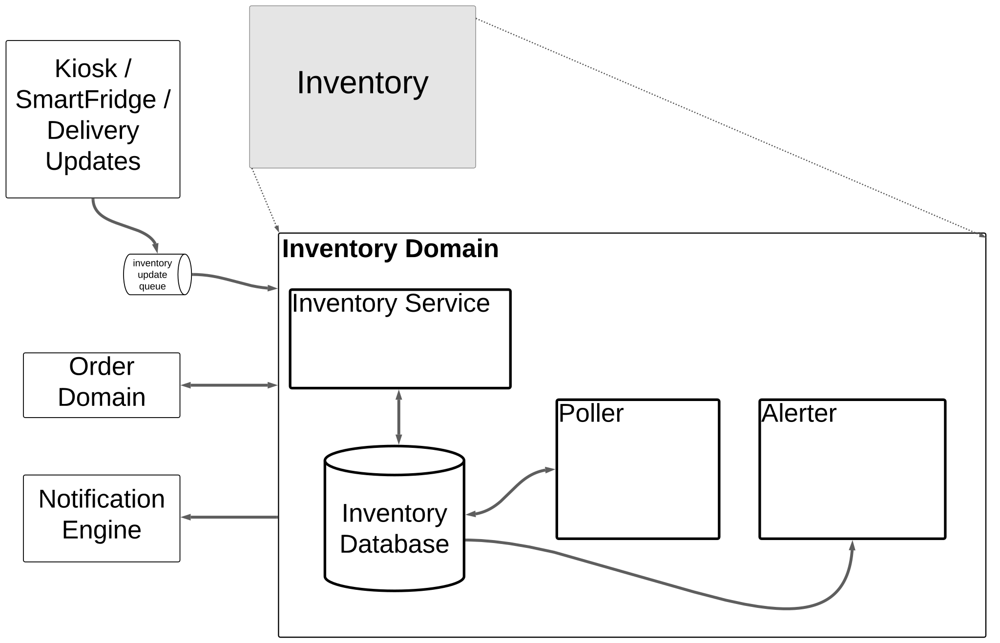

# [Inventory Domain](../../../README.md)

The Inventory Domain consists of 3 major subsystems and 1 major databases. It manages and controls access to remote inventory data, providing information to authorized users. The inventory domain manages not only the count/type of items available at each SmartFridge/Kiosk, but also maintains the count of "reserved" items so that they can no longer be offered to customers. Inventory updates are entered into a durable, time ordered, processed exactly once queue to ensure inventory correctness.

The **Inventory Service** provides the interface and authorization based on presented ID. All requests to the inventory domain **must** go through the **Inventory Service**.

The **Poller** is responsible for periodically reaching out to all of the known SmartFridge devices, getting the current inventory, and updating stored inventory based on reported information.

The **Alerter** is responsible for the restock lists for delivery drivers and notifying if a SmartFrige/Kiosk goes below a specified level or food reaches it's expiration date so that a delivery driver can be dispatched to restock.

The **Inventory Database** maintains the source of truth of inventory for each SmartFridge/Kiosk.

## Communicates with:
* [Notification Engine](/doc/arc/components/notification_engine.md) for sending out restock notifications
* [Order Domain](/doc/arc/components/order_domain.md) to "reserve" items for future pickup
* [UI Component](/doc/arc/components/ui_component.md) to:
  * Provide customers with available options based on location
  * Allow for updates by delivery drivers upon restock
* SmartFridge via proprietary API
