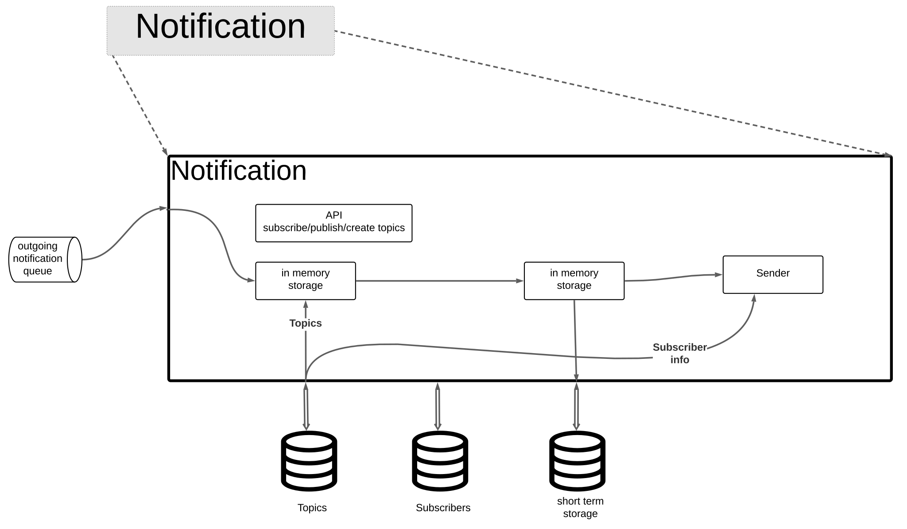

# [Notification Engine](../../../README.md)

Notification engine contains 4 major subcompoents and 2 major databases. It provides a single entry point for sending notifications via various mechanisms. It reduces the effort of having each domains within the system creates and maintains its own notification module.

The **Public API** provides APIs such as <code>create_topic, subscribe_topic</code> and <code>publish_message</code>, for other services to interact with Notification engine. The topics and subscribers are added to the **Topics and Subscribers Databases**

The **Message Retriever** is responsible of interaction with the queue.

The **Retry Mechanism** ensures each client receives message at least once. It has in-memory database to retry the message for a predefined number of time, and when all these attempts fail, it persistents the message into **Short Term Message Database** for retry later.

The **Sender** encapsulates all the details of interfacing with SMS, Email Push Notification libraries.

## Communicates With:
* [Billing Domain](/doc/arc/components/billing_domain.md) Receive billing confirmations.
* [Customer Domain](/doc/arc/components/customer_domain.md) for customer preferences/information used in model building
* [Inventory Domain](/doc/arc/components/inventory_domain.md) Receive restock notifications.
* [Order Domain](/doc/arc/components/order_domain.md) Receive internal order status updates.
* [Recommendation Engine](/doc/arc/components/recommendation_engine.md) for notifying customers of new recommendations.
