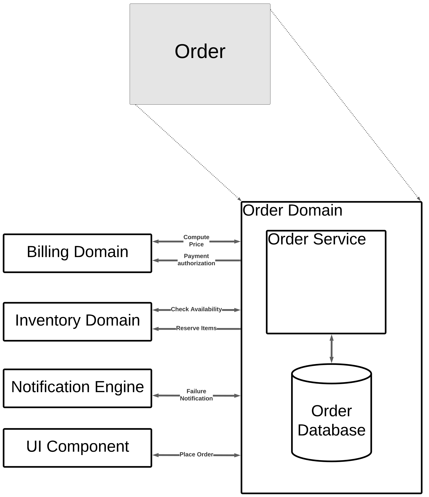

# [Order Domain](../../../README.md)

The Order Domain consists of 1 major subsystem and 1 major database. It manages and controls access to current and past orders, providing data to authorized users.

The **Order Service** provides the interface and authorization based on presented ID. All requests to the order domain **must** go through the **Order Service**. The **Order Service** must be rapidly scalable/burstable to handle the bursty nature of demands, able to maintain high availability and low latency not only when demand is low (local midnight/early mornings), but also at times when demand can spike quickly (local lunchtime)

The **Order Database** maintains the source of truth for the for all orders. It includes current, fulfilled, and canceled orders.

## Comminicates With:
* [Billing Domain](/doc/arc/components/billing_domain.md) to get current price and being payment transaction
* [Inventory Domain](/doc/arc/components/invnetory_domain.md) to ensure items are available and reserve items for pickup
* [Notification Engine](/doc/arc/components/notification_engine.md) for sending out failure notifications
* [UI Component](/doc/arc/components/ui_component.md) for collecting/displaying customer data with the customer
