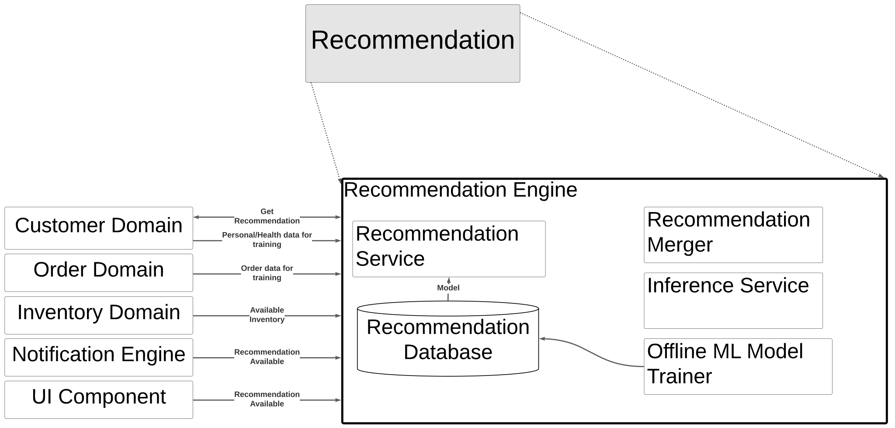

# [Recommendation Engine](../../../README.md)

The **Recommendation Engine** is the core of Farmacy Food's value add. It consists of 3 major online components, an offline/batch component, and 1 major database. In the initial implementation the ML component will not be implemented, instead relying on manual input from nutritionists to set the recommendations, but the addition of the MLcomponent is planned and designed for.

The **Recommendation Service** provides the interface and authorization based on presented ID. All requests to the recommendation engine **must** go through the **Recommendation Service**.

The **Offline ML Model Trainer** batch component will periodically take customer preferences, medical information, and Farmacy Food's menu data and create a personalized recommendation model. The **Offline ML Model Trainer** will also be able to use aggregated/anonymized data to produce more generic recommendation models for different categorizations of customers and to provide insights into what kinds of items would be interesting/valuable to add to the menu. It runs offline so latency/scalability is of limited concern.

The **Inference Service** takes precalculated models and runs them against the current inventory to generate a specific recommendation that can be fulfilled by inventory on-hand.

The **Recommendation Merger** takes the specific personalized recommendation generated and merges it with the autmatically generated generic reccomandations and any manually created generic/personalized recommendations. This ensures that as long as there is a manually defined recommendation every request will have something to return.

The **Recommendation Database** maintains the source of truth for all recommendation models, specific and generic, both automatically and manually generated.

## Communicates with:
* [Customer Domain](/doc/arc/components/customer_domain.md) for customer preferences/information used in model building
* [Inventory Domain](/doc/arc/components/inventory_domain.md) for information on current inventory
* [Notification Engine](/doc/arc/components/notification_engine.md) for letting customers know a new recommendation is available
* [Order Domain](/doc/arc/components/order_domain.md) for access to customer meal ratings and order history
* [UI Component](/doc/arc/components/ui_component.md) for displaying recomendations to the customer

